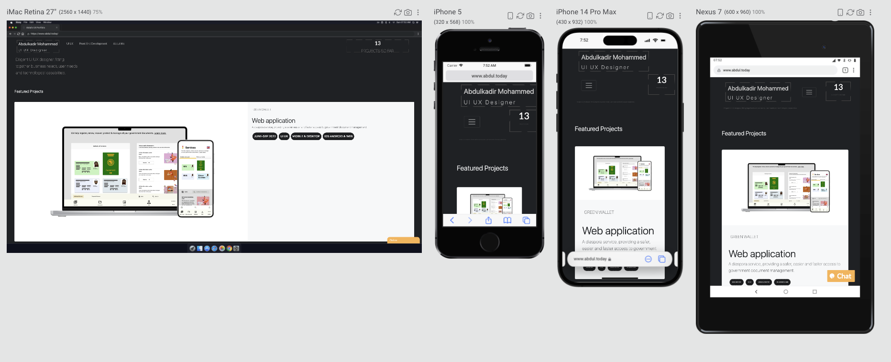

# Abdulkadir Mohammed's UI UX & Front End Developer Portfolio
 
 What the site looks like:

- - - 
Link to the live site
[abdul's portfolio]: https://www.abdul.today/ 

## Description

My portfolio. is where I showcase my skills and past work to be able to attract employers and clients.

You will find a UX skills and a front end development skills page where you will witness my capabilities through project descriptions.

## Table of Contents

* About the project
* Results
* Tests
* license

#### About the project
My portfolio is a life long ongoing project that is quite anoying to keep up with, but it is a requirement in my field of work, CV does not do justice to proofing my skills.

#### Results
I have been building my portfolio since I decided to pursue this career, It has been a long and challenging journey but I keep going.

The current portfolio is developed in Bootstrap, HTML, CSS, and Js. Hopefully I will creat a CRM in October CMS as planned to make portfolio writing easier.

## Tests
### Testing simple static website is fairly easy, I focused testing the UI.
#### Test 1: The GUI design:
I compared the reference design with my developed website, the result is simillar with a little change in the development stage.
I checked all the elements are presented the same way as the design, and redesigned the newly added elements in development.

#### Test 2: The fonts.
I checked the font size, font spacing and colour to make sure everything is reproduced as the design. 

#### Test 3: Links.
I checked the links work fine, and looked out for broken links.

#### Test 4: Spelling.
I checked for spelling and grammar errors.

#### Test 5: Images.
I checkd the image links both on the local and remote server.

#### Test 6: Scroll bar.
I checked the scroll bar carefully and to mak sure it all works as expected.

#### Test 7: Errors.
I checked to make sure it is an error free webpage, this includes responsiveness, spelling, closed brackets, UI and Console inspecttion.

#### Test 8: Validating with W3 validator.
Corrected all errors that came up in W3 validator.
Made sure it is validated and follows the W3C standard.

#### Test 8: Check loading speed using chrome dev tools.
Used network tab to explore opportunitites to improve site performance:

Using performance tab to check performance:

No futher tests reqauired as this is a one page static site.

## Licence

The is an M.I.T licence

---

